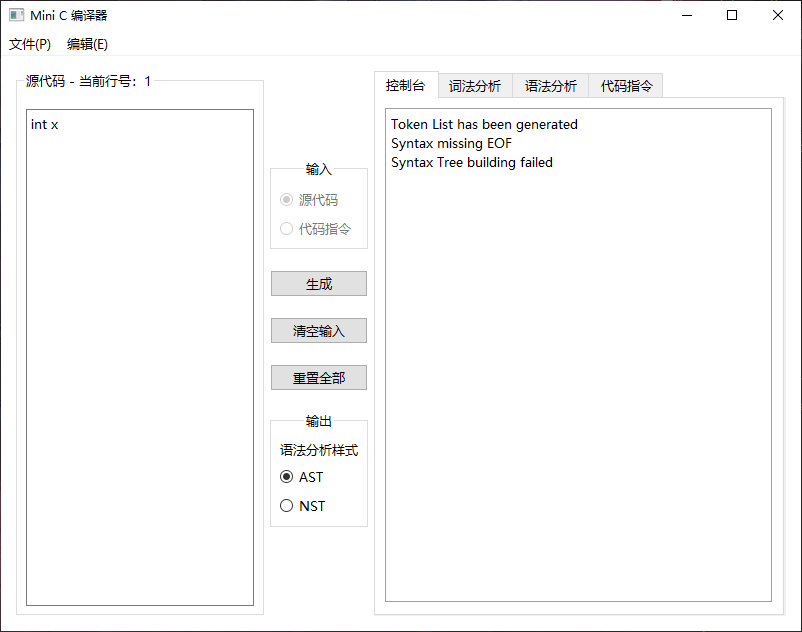
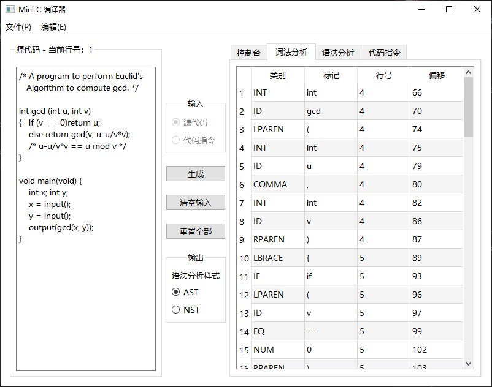
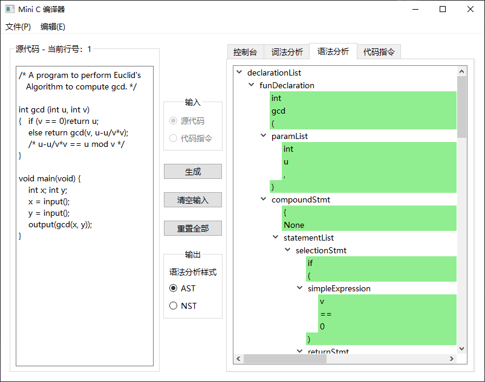

# C语言编译器 Mini C 
## 编译原理课程项目   

罗佳海 20172131144  
吴梓祺 20172131096  
华南师范大学计算机学院2017级   

<br/>
<br/>

## 项目运行  

1. 打开 main.exe   

2. 在“源代码”输入框输入内容  

3. 点击“生成”按钮

4. 界面右侧选择相应 tab 查看结果
   
<br/>
<br/>

## 项目目录结构

```python
# 每一个 py 文件都可以独立测试运行  

├── MiniC
│      │  
│      ├── exe                                    其中的 main.exe 为可执行文件入口  
│      │     
│      ├── minic
│      │      │    
│      │      ├── bin
│      │      │      │
│      │      │      ├── MyCodeEmittingUtil.py    Tiny VM Code emitting utilities（未完成）
│      │      │      ├── MyCodeGenerator.py       Tiny 代码生成器（未完成）
│      │      │      ├── MyLexer.py               词法分析器
│      │      │      ├── MyParser.py              语法分析器
│      │      │      ├── MySemanticAnalyzer.py    语义分析器（未完成）
│      │      │      ├── MyStream.py              重定向控制台输出
│      │      │      ├── MySymbolTable.py         符号表实现
│      │      │      └── MyTreeNode.py            自定义语法树节点类
│      │      │                            
│      │      ├── mainwindow.py                   mainwindow.ui的实现（PyQt自动生成）
│      │      ├── mainwindow.ui                   PyQt Designer设计的界面
│      │      ├── MyMainWindow.py                 自定义主窗口（绑定mainwindow）
│      │      └── main.py                         程序入口
│      │ 
│      └── testcases                              测试用例
│      
└──  README.md
```

<br/>
<br/>

## 项目进度

- [x] 词法分析（100%）
- [x] 语法分析（100%）
- 语义分析（50%）
- 代码生成（10%）
- 解释执行（0%）

<br/>
<br/>

## 功能说明  


| 功能 | 描述 |
| :---- | :---- |
| 菜单栏 - 文件 |  |
| 新建 | 打开文件对话框，新建一个.tny文件。 |  
| 打开 | 打开文件对话框，选择一个.tny文件。打开后会输出文件内容到“源代码”输入框。 |
| 保存 | 如果当前未打开过文件（MyMainWindow的__file_path属性为空），则调用“保存为”方法，否则直接保存“源代码”输入框的内容到__file_path路径。 |
| 保存为 | 打开文件对话框，选择保存的路径，保存“源代码”输入框的内容到文件。 |
| 退出 | 无条件退出。 |
| 菜单栏 - 编辑 |  |
| 清空输入 | 清空“源代码”输入框的内容。 |
| 重置全部 | 清空“源代码”输入框的内容，并清空输出结果。 |
| 控制台 |  |
| 生成 - 控制台 | 输出print的内容 |
| 词法分析 |  |
| 生成 - 词法分析 | 通过QTableWidget输出标记序列内容 |
| 语法分析 |  |
| 生成 - 语法分析 | 通过QTreeWidget输出语法树内容 |

<br/>
<br/>

## 测试数据

| 覆盖范围 | 测试用例  |
| :---- | :---- |
| 词法分析：保留字、普通标识符、整型、c注释、c++注释、换行、空格 | t1.tny |
| 结果 |  | 
| 测试用例内容 |  |
```txt 
if else int return void while input output
+ - * / > < >= <= == != ; , = ( ) [ ] { }

31 _dwa
// comment
/* multi 
comment */
```

<br/>

| 覆盖范围 | 测试用例  |
| :---- | :---- |
| 词法分析：不合法字符的错误处理 | t2.tny |
| 结果 |  | 
| 测试用例内容 |  |
```txt 
void main(){
深
}
```

<br/>

| 覆盖范围 | 测试用例  |
| :---- | :---- |
| 语法分析：语法规则第1-5条 | t3.tny |
| 结果 |  | 
| 测试用例内容 |  |
```txt 
int x;
int x[10];
```

<br/>

| 覆盖范围 | 测试用例  |
| :---- | :---- |
| 语法分析：语法规则第1-12条 | t4.tny |
| 结果 |  | 
| 测试用例内容 |  |
```txt 
void main() {
}
int gcd(int x, int y){
}
```

<br/>

| 覆盖范围 | 测试用例  |
| :---- | :---- |
| 语法分析：语法规则第1-15条、第17-24条、第26条 | t5.tny |
| 结果 |  | 
| 测试用例内容 |  |
```txt 
int minloc(int a[], int low, int high) {  
  if(a[i]< 1)
  {   x =a[i];
      k=i + 1;
  }
  return k;
}
```

<br/>

| 覆盖范围 | 测试用例  |
| :---- | :---- |
| 语法分析：语法规则第1-14条、第16-24条、第26-29条 | t6.tny |
| 结果 |  | 
| 测试用例内容 |  |
```txt 
void sort( int a[], int low, int high)
{   int i; int k;
    i=low;
    while(i<high-1)
    {   int t;
        k=minloc(a,i,high);
    }
}
```

<br/>

| 覆盖范围 | 测试用例  |
| :---- | :---- |
| 语法分析：if-else 文法 | t7.tny |
| 结果 |  | 
| 测试用例内容 |  |
```txt 
void test() {
  if(x < 1) 
    if (y < 2)
      x = 3;
    else 
      y = 3;
  else
    z = 4;
}
```

<br/>

| 覆盖范围 | 测试用例  |
| :---- | :---- |
| 语法分析：末尾标记的错误处理 | t8.tny |
| 结果 |  | 
| 测试用例内容 |  |
```txt 
void sort( int a)
{   
```

<br/>

| 覆盖范围 | 测试用例  |
| :---- | :---- |
| 语法分析：中间标记的错误处理 | t9.tny |
| 结果 |  | 
| 测试用例内容 |  |
```txt 
void sort( int a)
{   
  int
}
```

<br/>

| 覆盖范围 | 测试用例  |
| :---- | :---- |
| 项目指导书第1个测试用例（修改了第11行） | t10.tny |
| 结果 |  | 
| 测试用例内容 |  |
```txt 
/* A program to perform Euclid's
   Algorithm to compute gcd. */

int gcd (int u, int v)
{   if (v == 0)return u;
    else return gcd(v, u-u/v*v);
    /* u-u/v*v == u mod v */
}

void main(void) {
    int x; int y;
    x = input();
    y = input();
    output(gcd(x, y));
}
```


<br/>

| 覆盖范围 | 测试用例  |
| :---- | :---- |
| 项目指导书第2个测试用例 | t11.tny |
| 结果 |  | 
| 测试用例内容 |  |
```txt 
/* A program to perform selection sort on a 10
    element array. */
int x[10];
int minloc(int a[], int low, int high)
{   int i; int x; int k;
    k = low;
    x = a[low];
    i = low + 1;
    while(i<high)
    {   if(a[i]< x)
        {   x =a[i];
            k=i;
        }
        i=i+1;
    }
    return k;
}

void sort( int a[], int low, int high)
{   int i; int k;
    i=low;
    while(i<high-1)
    {   int t;
        k=minloc(a,i,high);
        t=a[k];
        a[k]= a[i];
        a[i]=t;
        i=i+1;
    }
}

void main(void)
{   int i;
    i=0;
    while(i<10)
    {   x[i]=input();
        i=i+1;
        sort(x,0,10);
        i=0;
        while(i<10)
        {   output(x[i]);
            i=i+1;
        }
    }
}
```

<br/>
<br/>

## 开发环境

- IDE: PyCharm 2019.3.3 (Community Edition)
- Python: Python 3.7 (Anacoda3)
- PyQt: PyQt5
- Libs: ply

<br/>
<br/>

## 项目打包  

- [导入包的注意事项](https://blog.csdn.net/djshichaoren/article/details/79801531)
- [通过 py 文件 或 spec 文件打包](https://blog.csdn.net/king_mountian/article/details/81664599)  

- 附：制作 spec

- 如果项目在import导入时，没有按照子目录格式进行导入，则对于本项目来说，要打包多个 py 文件，则需要在 .spec 文件中设置绝对路径
  > ...  
  > a = Analysis(['main.py',
              'C:\\Users\\Ryzin\\Desktop\\PyProject\\MiniC\\minic\\mainwindow.py',
              'C:\\Users\\Ryzin\\Desktop\\PyProject\\MiniC\\minic\\MyMainWindow.py',
              'C:\\Users\\Ryzin\\Desktop\\PyProject\\MiniC\\minic\\bin\\MyCodeEmittingUtil.py',
              'C:\\Users\\Ryzin\\Desktop\\PyProject\\MiniC\\minic\\bin\\MyCodeGenerator.py',
              'C:\\Users\\Ryzin\\Desktop\\PyProject\\MiniC\\minic\\bin\\MyLexer.py',
              'C:\\Users\\Ryzin\\Desktop\\PyProject\\MiniC\\minic\\bin\\MyParser.py',
              'C:\\Users\\Ryzin\\Desktop\\PyProject\\MiniC\\minic\\bin\\MySemanticAnalyzer.py',
              'C:\\Users\\Ryzin\\Desktop\\PyProject\\MiniC\\minic\\bin\\MyStream.py',
              'C:\\Users\\Ryzin\\Desktop\\PyProject\\MiniC\\minic\\bin\\MySymbolTable.py',
              'C:\\Users\\Ryzin\\Desktop\\PyProject\\MiniC\\minic\\bin\\MyTreeNode.py',
              'C:\\Users\\Ryzin\\Desktop\\PyProject\\MiniC\\minic\\bin\\parsetab.py'],  
             pathex=['C:\\Users\\Ryzin\\Desktop\\PyProject\\MiniC\\minic'],   
             ...


  在终端中的项目根目录下的 minic 文件夹中

- 使用控制台子系统执行
  > pyinstaller -c main.spec

- 使用Windows子系统执行（启动时不打开命令行）
  > pyinstaller -w main.spec