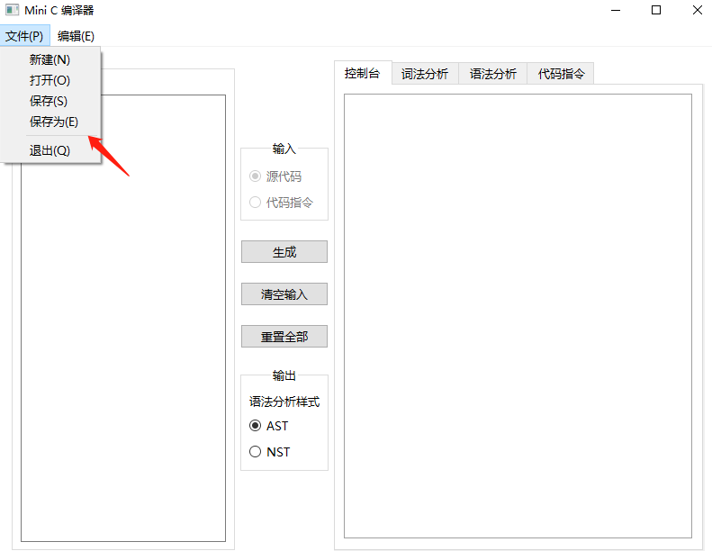
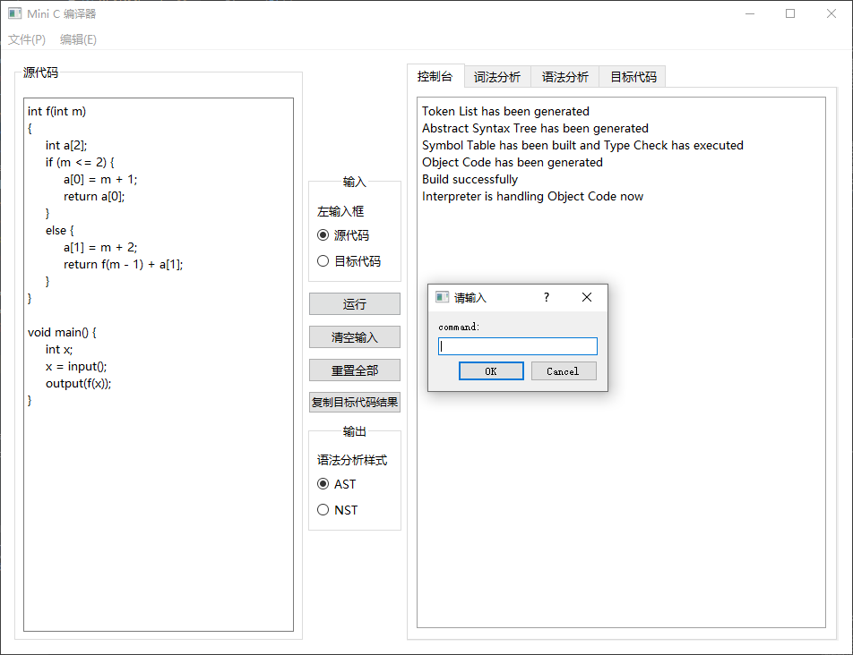

# 简易 C 语言编译器 / Mini C / Simple C Compiler / C -


<br/>
<br/>


## Index
  - [Contributors](#contributors)
  
  - [Introduction](#introduction)
  - [More](#more)
  - [Lex and Grammar](#lex-and-grammar)
  - [Features](#features)
  - [Environment](#environment)
  - [How to use](#how-to-use)
  - [Repository Structure](#repository-structure)
  - [How to export a realease version](#how-to-export-a-realease-version)
  - [References](#references)


<br/>
<br/>


## Contributors  

- Contributors
  - 罗佳海 20172131144  
  - 吴梓祺 20172131096  

- Organization  
  South China Normal University, Computer Science, 2017   


<br/>
<br/>


## Introduction

> 题目出处自《编译原理与实践》Kenneth C.Louden 一书的“[附录 A 编译器设计方案](c_minus.pdf)”

本项目是基于 ply 和 PyQt5 开发的一个简易的 C 语言编译器。  
本来想说作为我校编译原理的一个期末课程作业，作为普通作业做一下就可以了。但是做的过程发现还是挺有意思的，所以就多用了点心思，不仅完整的完成了所有功能，还提供一个比较美观的 GUI 界面。  
不过本项目还是有许多问题，比如没有做好二元运算的左值右值类型检查，函数栈本地变量表的记录等，这也大概就是浴帘只给我一个靠近 90 分的分数而已吧。（逃


<br/>
<br/>


## More

> [项目设计报告书](项目设计文档.pdf)    
> [测试用例说明](TESTCASES.md)


<br/>
<br/>


## Lex and Grammar

> [词法规则和语法规则](c_minus.pdf)


<br/>
<br/>


## Features

- [x] 词法分析 Lexer

- [x] 语法分析 Parser

- [x] 语义分析 Semantic Analyzer

- [x] 代码生成 Code Generator

- [x] 解释执行 Interpreter


<br/>
<br/>


## Environment

- IDE: PyCharm 2019.3.3 (Community Edition)

- Python: Python 3.7 (Anacoda3)

- PyQt: PyQt5

- Libs: ply


<br/>
<br/>


## How to use  

0. pip install 所有需要的依赖

1. 运行 main.py   

2. 在“源代码”输入框输入内容  

3. 点击“生成”按钮

4. 界面右侧选择相应 tab 查看结果
   

<br/>
<br/>


| Features | Description |
| :---- | :---- |
| 菜单栏 - 文件 |  |
| 新建 | 打开文件对话框，新建一个.tny或者.tm文件。 |  
| 打开 | 打开文件对话框，选择一个.tny或者.tm文件。打开后会输出文件内容到“源代码”输入框。 |
| 保存 | 如果当前未打开过文件（MyMainWindow的__file_path属性为空），则调用“保存为”方法，否则直接保存“源代码”输入框的内容到__file_path路径。 |
| 保存为 | 打开文件对话框，选择保存的路径，保存“源代码”输入框的内容到文件。 |
| 退出 | 无条件退出。 |
| 菜单栏 - 编辑 |  |
| 清空输入 | 清空“源代码”输入框的内容。 |
| 重置全部 | 清空“源代码”输入框的内容，并清空输出结果。 |
| 工具栏 - 输入 |  |
| 源代码 | 选择该选项后，点击“运行”按钮后，源代码进行词法分析、语法分析、生成目标代码并解释执行。 |
| 目标代码 | 选择该选项后，点击“运行”按钮后，目标代码解释执行。 |
| 目标代码 - 运行|  |
| 工具栏 - 输出 |  |
| AST | 选择该选项后，点击“运行”按钮后，语法分析输出抽象语法树。 |
| NST | 选择该选项后，点击“运行”按钮后，语法分析输出普通语法树。 |
| 控制台 |  |
| 运行 - 控制台 | 输出print的内容。 |
| 词法分析 |  |
| 运行 - 词法分析 | 通过QTableWidget输出标记序列内容。 |
| 语法分析 |  |
| 运行 - 语法分析 | 通过QTreeWidget输出语法树内容。 |
| 目标代码 |  |  
| 运行 - 目标代码 | 打印目标代码 |
| 解释执行 |  |  
| 运行 - 解释执行 | 在控制台输入解释执行的输入，控制台输出解释执行的结果。 |
| 复制目标代码结果 | 将目标代码复制到剪贴板 |


<br/>
<br/>


```python
# 解释执行命令 command（增加了命令 m，打印函数栈）

command:  h
Commands are:
   s(tep <n>      Execute n (default 1) TM instructions
   g(o            Execute TM instructions until HALT
   r(egs          Print the contents of the registers
   i(Mem <b <n>>  Print n iMem locations starting at b
   d(Mem <b <n>>  Print n dMem locations starting at b
   t(race         Toggle instruction trace
   p(rint         Toggle print of total instructions executed ('go' only)
   c(lear         Reset simulator for new execution of program
   m(ethod stack  Print Method Stack
   h(elp          Cause this list of commands to be printed
   q(uit          Terminate the simulation
```


<br/>
<br/>


## Repository Structure

```python
# 基本每一个 py 文件都可以独立测试运行。
# 但以脚本运行时，需要将py文件中最上方非 main.py 的 import 注释去掉，并注释掉 main.py 需要的 import

MiniC
│     
├── img                                    展示图片
│      
├── minic                                  实际源代码根目录
│      │    
│      ├── bin
│      │      │
│      │      ├── MyCodeEmittingUtil.py    代码发行
│      │      ├── MyCodeGenerator.py       代码生成器
│      │      ├── MyLexer.py               词法分析器
│      │      ├── MyInterpreter.py         解释执行器
│      │      ├── MyInput.py               获取输入提供给解释执行器
│      │      ├── MyParser.py              语法分析器
│      │      ├── MySemanticAnalyzer.py    语义分析器
│      │      ├── MyStream.py              重定向控制台输出
│      │      ├── MySymbolTable.py         符号表实现
│      │      └── MyTreeNode.py            自定义语法树节点类
│      │                            
│      ├── mainwindow.py                   mainwindow.ui的实现（PyQt自动生成）
│      ├── mainwindow.ui                   PyQt Designer设计的界面
│      ├── MyMainWindow.py                 自定义主窗口（绑定mainwindow）
│      └── main.py                         程序入口
│ 
├── testcases                              测试用例
│ 
├── README.md                              项目说明
│
└── TESTCASES.md                           测试用例说明
```


<br/>
<br/>


## How to export a realease version  

  在终端中的项目根目录下的 minic 文件夹中

- 使用控制台子系统执行
  > - 通过 spec   
  >   pyinstaller -c main.spec
  > - 不通过 spec   
  >   pyinstaller -c main.py 

- 使用Windows子系统执行（启动时不打开命令行）
  > pyinstaller -w main.spec


> - [导入包的注意事项](https://blog.csdn.net/djshichaoren/article/details/79801531)
> - [通过 py 文件 或 spec 文件打包](https://blog.csdn.net/king_mountian/article/details/81664599)  
> - 附：制作 spec
>   - 如果项目在import导入时，没有按照子目录格式进行导入，则对于本项目来说，要打包多个 py 文件，则需要在 .spec 文件中设置绝对路径
    > ...  
    > a = Analysis(['main.py',
                'C:\\Users\\Ryzin\\Desktop\\PyProject\\MiniC\\minic\\mainwindow.py',
                'C:\\Users\\Ryzin\\Desktop\\PyProject\\MiniC\\minic\\MyMainWindow.py',
                'C:\\Users\\Ryzin\\Desktop\\PyProject\\MiniC\\minic\\bin\\MyCodeEmittingUtil.py',
                'C:\\Users\\Ryzin\\Desktop\\PyProject\\MiniC\\minic\\bin\\MyCodeGenerator.py',
                'C:\\Users\\Ryzin\\Desktop\\PyProject\\MiniC\\minic\\bin\\MyLexer.py',
                'C:\\Users\\Ryzin\\Desktop\\PyProject\\MiniC\\minic\\bin\\MyParser.py',
                'C:\\Users\\Ryzin\\Desktop\\PyProject\\MiniC\\minic\\bin\\MySemanticAnalyzer.py',
                'C:\\Users\\Ryzin\\Desktop\\PyProject\\MiniC\\minic\\bin\\MyStream.py',
                'C:\\Users\\Ryzin\\Desktop\\PyProject\\MiniC\\minic\\bin\\MySymbolTable.py',
                'C:\\Users\\Ryzin\\Desktop\\PyProject\\MiniC\\minic\\bin\\MyTreeNode.py',
                'C:\\Users\\Ryzin\\Desktop\\PyProject\\MiniC\\minic\\bin\\parsetab.py'],  
               pathex=['C:\\Users\\Ryzin\\Desktop\\PyProject\\MiniC\\minic'],   
               ...


<br/>
<br/>


## References

[1] Python Lex Yacc 手册, 
https://wiki.jikexueyuan.com/project/python-lex-yacc/ (2018/11/28)  

[2] 嵌套作用域
http://www.opython.com/1594.html (2018-08-06)  

[3] 函数调用——函数栈
https://www.cnblogs.com/rain-lei/p/3622057.html (2014-03-24)  

[4] 编译原理与实践, Kenneth C.Louden  


<br/>
<br/>


## Back
[Back](#index)